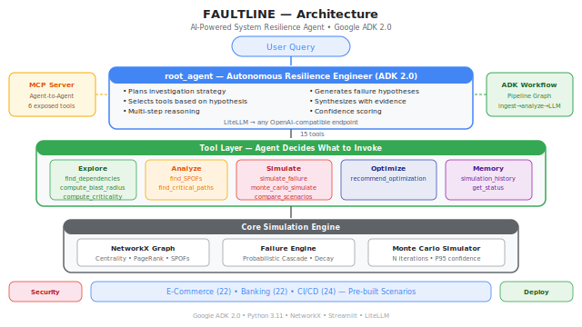

# ⚡ FAULTLINE

### AI-Powered System Resilience/ Fragility Agent

> An autonomous resilience engineer that investigates system architecture, simulates cascading failures, compares failure hypotheses, and recommends cost-effective optimizations — with quantified evidence and confidence.


**Track: Agents for Business**

---

## Problem Statement

Enterprise systems fail in cascading, unpredictable ways. A single Redis timeout can propagate through 8 services, take down checkout, and cost $12K/minute in lost revenue. Traditional monitoring detects failures *after* they happen. Teams need a way to **predict** which components are fragile, **simulate** what happens when they fail, and **prioritize** where to invest in resilience — before the outage reaches customers.

## Solution

Faultline is an **agentic system resilience platform** that autonomously:
- **Plans** multi-step investigations (not just tool calls)
- **Maps** system architecture into dependency graphs
- **Hypothesizes** multiple failure scenarios and compares them
- **Simulates** cascading failures with Monte Carlo statistical confidence
- **Optimizes** by recommending the most cost-effective resilience improvements

The agent doesn't just answer questions — it **reasons**. It formulates investigation plans, selects tools based on hypotheses, and synthesizes findings with quantified evidence and confidence levels.

---

## Agent Reasoning Example

```
User: "What happens if Redis starts degrading during Black Friday?"
```

**Agent autonomously plans and executes:**

```
Goal: Assess Redis failure impact on ecommerce system during peak load

Plan:
1. Load ecommerce topology
2. Find Redis dependencies and dependents
3. Compute Redis criticality score
4. Identify which critical paths Redis sits on
5. Simulate memory_pressure failure at high intensity
6. Run Monte Carlo (50 iterations) for statistical confidence
7. Compare against alternative failure hypotheses
8. Generate optimization recommendations with evidence

Executing...

✓ Loaded ecommerce scenario (22 nodes, 34 edges)
✓ Redis has 5 downstream dependents (Inventory, Session, Cart, Checkout, Search)
✓ Criticality score: 0.847 — rank 2/22 (CRITICAL)
✓ Redis sits on 3 of 5 critical dependency paths
✓ Single simulation: 8 nodes affected, cascade depth 4, severity CRITICAL
✓ Monte Carlo (50 runs): mean 7.2 affected, P95 worst-case 11 nodes
✓ Compared Redis vs Payment Gateway vs Auth — Redis is highest risk
✓ Generated 4 optimization strategies ranked by efficiency
```

**Synthesized Result:**

```
Risk Score: 92% (CRITICAL)
Confidence: HIGH (Monte Carlo, 50 iterations)

Predicted Cascade:
  Redis → Inventory → Checkout → Payment Retry Queue → Customer Session Loss

Evidence:
  • Redis appears on 60% of critical paths (3/5)
  • Blast radius: 36% of system (8/22 nodes)
  • P95 downtime estimate: 340 seconds
  • Revenue impact: ~$12K/min at Black Friday traffic

Ranked Recommendations:
  1. [CRITICAL] Add Redis replica with failover
     Why: Eliminates SPOF affecting 8 nodes
     Impact: Reduces blast radius by 41%
     Confidence: 93% (Monte Carlo confirmed)

  2. [HIGH] Circuit breaker on Checkout → Inventory path
     Why: Criticality 0.847, prevents synchronous cascade
     Impact: Reduces cascade depth from 4 to 2

  3. [HIGH] Queue backpressure threshold at 70%
     Why: Absorbs load spikes before they propagate
     Impact: Reduces failure probability by 26%

  4. [MEDIUM] Cache-aside pattern for inventory reads
     Why: Decouples read path from Redis availability
     Impact: Reduces affected nodes by 2
```

---

## Architecture

Built on [Google ADK 2.0](https://adk.dev/). The LLM acts as an **autonomous planner** — it decomposes goals, selects tools, executes multi-step investigations, and synthesizes findings.



```
User Query
   │
   ▼
┌─────────────────────────────────────────────┐
│  root_agent (Autonomous Resilience Engineer) │
│                                             │
│  • Formulates investigation plan            │
│  • Selects tools based on hypothesis        │
│  • Maintains context across steps           │
│  • Generates multiple failure hypotheses    │
│  • Synthesizes with evidence + confidence   │
└──────────────────┬──────────────────────────┘
                   │ (15 composable tools)
                   ▼
┌─────────────────────────────────────────────┐
│  Tool Layer (Agent decides what to invoke)   │
│                                             │
│  Explore          Analyze        Simulate   │
│  ─────────        ───────        ────────   │
│  find_dependencies  find_SPOFs   simulate   │
│  find_dependents    find_paths   monte_carlo│
│  compute_blast      criticality  compare    │
│                                             │
│  Optimize         Memory                    │
│  ────────         ──────                    │
│  recommend_       simulation_               │
│  optimization     history                   │
└──────────────────┬──────────────────────────┘
                   │
                   ▼
┌─────────────────────────────────────────────┐
│  Core Engine                                 │
│                                             │
│  NetworkX Graph │ Failure Engine │ Simulator │
│  (centrality,   │ (probabilistic │ (Monte   │
│   PageRank,     │  propagation,  │  Carlo,  │
│   articulation) │  decay, load)  │  stats)  │
└─────────────────────────────────────────────┘
```

### Multi-Agent System

| Agent | Role | Implementation |
|-------|------|---------------|
| **Resilience Engineer** | Plans investigations, chains tools, synthesizes findings | `app/agent.py` — ADK `Agent` with 15 tools |
| **Insight Generator** | Produces structured risk assessments from simulation data | `app/workflow.py` — ADK `LlmAgent` with `output_schema` |
| **MCP Interface** | Exposes capabilities to external AI agents | `mcp_server.py` — Model Context Protocol |

### Why ADK Matters

| Capability | How It Works |
|-----------|-------------|
| **Planning** | Decomposes "is our payment system resilient?" into 7+ investigation steps |
| **Hypothesis generation** | Generates multiple failure candidates, simulates each, ranks by impact |
| **Tool composition** | Chains `find_dependents` → `compute_blast_radius` → `simulate_failure` → `monte_carlo_simulate` |
| **Statistical confidence** | Monte Carlo with randomized parameters gives P95 worst-case |
| **Optimization** | Compares redundancy vs circuit breakers vs decoupling — recommends highest efficiency |
| **Evidence trail** | Every recommendation cites specific metrics |

---

## Course Concepts Demonstrated

| Key Concept | Where | Implementation |
|-------------|-------|---------------|
| **Agent / Multi-agent (ADK)** | Code | `app/agent.py` (root_agent), `app/workflow.py` (insight_agent), multi-agent pipeline |
| **MCP Server** | Code | `mcp_server.py` — 6 tools exposed via Model Context Protocol |
| **Security Features** | Code | `security.py` — input validation, rate limiting, audit logging, API key management |
| **Deployability** | Code + Video | `Dockerfile`, Cloud Run instructions, `docker-compose` ready |
| **Agent Skills (Agents CLI)** | Code | Built using `.agent/skills/` — ADK code patterns, workflow design, scaffold conventions |

See [`AGENTS.md`](AGENTS.md) for detailed architecture documentation.
See [`SETUP_GUIDE.md`](SETUP_GUIDE.md) for judge-friendly setup and deployment instructions.

---

## Setup & Installation

### Prerequisites
- Python 3.11+
- An OpenAI-compatible LLM endpoint (or Google Gemini API key)

### Local Setup

```bash
# Clone the repository
git clone <repo-url>
cd faultline

# Install dependencies
pip install -r requirements.txt

# Configure environment
cp .env.example .env
# Edit .env: set OPENAI_API_KEY and OPENAI_BASE_URL
```

### Run the Agent

```bash
# Interactive investigation session (recommended)
python cli.py adk interactive

# Single-turn analysis
python cli.py adk chat "How resilient is the banking payment switch?"

# Full pipeline workflow
python cli.py adk workflow "ecommerce worst_case"

# Direct runner
python -m app.runner --interactive
```

### Streamlit Dashboard

```bash
streamlit run app.py
# Opens at http://localhost:8501
```

### MCP Server (for external agent integration)

```bash
python cli.py mcp
```

---

## Deployment

### Docker

```bash
docker build -t faultline .
docker run -p 8501:8501 --env-file .env faultline

# For agent CLI mode:
docker run --env-file .env faultline python -m app.runner --interactive
```

### Google Cloud Run

```bash
gcloud run deploy faultline \
  --source . \
  --allow-unauthenticated \
  --set-env-vars="OPENAI_API_KEY=your-key,LLM_MODEL=gpt-4o"
```

---

## Agent Tools (15 Composable)

The agent autonomously decides which tools to invoke and in what order:

| Category | Tools | Purpose |
|----------|-------|---------|
| **Setup** | `load_scenario`, `list_nodes` | Initialize system topology |
| **Explore** | `find_dependencies`, `find_dependents`, `compute_blast_radius`, `compute_node_criticality` | Navigate and assess the graph |
| **Analyze** | `find_single_points_of_failure`, `find_critical_paths` | Identify structural vulnerabilities |
| **Simulate** | `simulate_failure`, `monte_carlo_simulate`, `compare_failure_scenarios` | Test hypotheses with statistical rigor |
| **Optimize** | `recommend_optimization` | Find most cost-effective improvements |
| **Memory** | `get_simulation_history` | Learn from past investigations |
| **Status** | `get_system_status`, `get_fragility_report` | Current state assessment |

---

## Scenarios

| Scenario | Nodes | Architecture |
|----------|-------|-------------|
| 🛒 **E-Commerce** | 22 | Checkout, payment, inventory, caching, CDN, external APIs |
| 🏦 **Banking** | 21 | Core banking, fraud detection, payment switch, compliance, SWIFT |
| ⚙️ **CI/CD** | 23 | Kubernetes, service mesh, container registry, CI/CD pipeline |

---

## Project Structure

```
faultline/
├── app/                    # ADK 2.0 Agent
│   ├── agent.py            # root_agent — autonomous resilience engineer
│   ├── workflow.py         # ADK Workflow pipeline (multi-agent)
│   ├── tools.py            # 15 composable FunctionTools
│   ├── schemas.py          # Pydantic I/O schemas
│   └── runner.py           # Programmatic ADK runner
├── core/                   # Simulation engine
│   ├── graph_builder.py    # NetworkX dependency graph
│   ├── failure_engine.py   # Probabilistic cascade propagation
│   ├── simulator.py        # Monte Carlo simulation
│   └── models.py           # Data models
├── scenarios/              # Pre-built system topologies
├── ui/                     # Streamlit visualizations
├── security.py             # Security: validation, rate limiting, audit
├── mcp_server.py           # MCP server (agent-to-agent)
├── app.py                  # Streamlit dashboard
├── cli.py                  # CLI interface
├── Dockerfile              # Container deployment
├── AGENTS.md               # Agent architecture documentation
└── pyproject.toml          # Dependencies
```

---

## Configuration

```env
OPENAI_API_KEY=your-key
OPENAI_BASE_URL=http://localhost:6655   # Any OpenAI-compatible endpoint
LLM_MODEL=gpt-4o
SIMULATION_MODE=false                   # true = run without LLM
```

Supports any OpenAI-compatible endpoint via LiteLLM (Hyperspace AI, Ollama, vLLM).
For Google Gemini: set `GOOGLE_API_KEY` instead.

---

## Technical Highlights

- **Autonomous planning** — Agent decomposes goals into investigation steps before executing
- **Multi-hypothesis reasoning** — Generates and compares multiple failure scenarios
- **Monte Carlo simulation** — Statistical confidence with randomized parameters (P95 worst-case)
- **Optimization engine** — Compares mitigation strategies by efficiency (risk reduction / effort)
- **Explainable AI** — Every recommendation includes evidence, quantified impact, and confidence
- **Session memory** — Tracks simulation history, identifies patterns across investigations
- **Multi-agent architecture** — Root agent + Insight agent + MCP server for external collaboration
- **Security-first** — Input validation, rate limiting, audit logging, injection prevention
- **Deployable** — Docker, Cloud Run, local development all supported

---

## License

MIT
